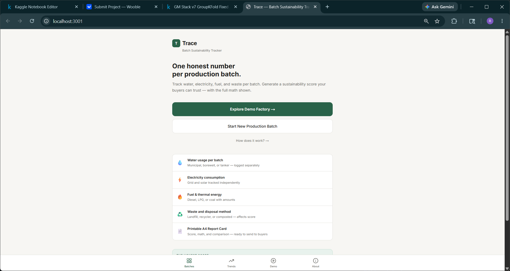

<p align="center">
  
</p>

<h1 align="center">Trace</h1>

<p align="center">
  <strong>One honest sustainability score per production batch. Built for Indian SME manufacturers.</strong>
</p>

<p align="center">
  
  
  
  
  
</p>

<p align="center">
  <a href="#quick-start">Quick Start</a> •
  <a href="#scoring-formula">How Scoring Works</a> •
  <a href="#features">Features</a> •
  <a href="#project-structure">Project Structure</a> •
  <a href="#deploy-to-vercel">Deploy</a>
</p>

---

## What is Trace?

Trace turns scattered operational records — water bills, electricity meter readings, fuel receipts, waste logs — into a **single auditable sustainability score (0–100)** per production batch. When a batch is closed, it generates a **printable A4 Report Card** with a full deduction breakdown, peer comparison, and a plain-language observation.

No spreadsheets. No consultants. No login required.

---

## Why Trace?

| Problem | How others solve it | How Trace solves it |
|---|---|---|
| Sustainability data lives in notebooks and bills | Manual spreadsheets, updated monthly | Log resource entries in real time, per batch |
| SMEs can't afford auditing software | Enterprise SaaS with per-seat pricing | Free, open-source, deployable in 5 minutes |
| Buyers want proof, not promises | Self-reported PDFs with no methodology | Auditable score formula published in `lib/scoring/calculateScore.ts` |
| No bandwidth for complex dashboards | Heavy web apps that require training | Mobile-first, works on a 2 GB RAM Android at 360 px wide |

---

## Features

- **Batch creation** — batch ID, product type, units produced, date, material
- **Resource logging** — water, electricity, fuel, and waste entries (unlimited per batch)
- **Scoring engine** — deterministic 0–100 score, formula isolated in `lib/scoring/` and never mixed into UI code
- **Report Card** — score, full deduction breakdown, per-unit metrics, batch comparison, and a plain-language observation
- **PDF export** — browser print → A4, clean layout via `@media print` CSS (no canvas hacks)
- **Trends dashboard** — line chart, top/bottom performing batches, recent activity
- **Demo factory** — 25 pre-loaded batches from Shakti Textiles (Tiruppur) for instant exploration
- **No login required** — deploy and start logging immediately

---

## Scoring Formula

The score starts at **100** and deductions are applied based on per-unit resource consumption:

| Criterion | Deduction |
|---|---|
| Water > 50 L/unit | −1 pt per 10 L above threshold, max −20 |
| Electricity > 2 kWh/unit | −1 pt per 0.5 kWh above threshold, max −20 |
| Any fuel used | −10 |
| Waste disposed to landfill or unknown | −15 |
| Waste sent to recycler | −5 |
| Waste composted or zero waste | 0 |
| Tanker water used | −10 |

**Final score is clamped to 0–100.**

The complete, authoritative logic lives in [`lib/scoring/calculateScore.ts`](lib/scoring/calculateScore.ts) — never duplicated in UI components.

---

## Tech Stack

| Layer | Choice |
|---|---|
| Frontend | Next.js 14 (App Router) + TypeScript + Tailwind CSS |
| Database | Supabase (PostgreSQL) |
| Charts | Recharts |
| PDF export | `@media print` CSS — no canvas, no external libs |
| Deployment | Vercel |

---

## Quick Start

### Prerequisites

- Node.js 18+
- A free [Supabase](https://supabase.com) account

### 1. Clone and install

```bash
git clone https://github.com/YOUR_USERNAME/trace.git
cd trace
npm install
```

### 2. Create a Supabase project

1. Go to [supabase.com](https://supabase.com) → **New project**
2. Copy your **Project URL** and **anon key** (Settings → API)
3. Also copy the **service role key** (same page — keep this secret)

### 3. Run the database schema

In your Supabase dashboard → **SQL Editor**, paste the contents of `supabase/schema.sql` and click **Run**.

### 4. Configure environment variables

```bash
cp .env.local.example .env.local
```

Edit `.env.local`:

```env
NEXT_PUBLIC_SUPABASE_URL=https://your-project-id.supabase.co
NEXT_PUBLIC_SUPABASE_ANON_KEY=your-anon-key-here
SUPABASE_SERVICE_ROLE_KEY=your-service-role-key-here
```

### 5. Run locally

```bash
npm run dev
```

Open [http://localhost:3000](http://localhost:3000)

### 6. Load demo data (optional)

Navigate to the **Demo** tab → click **Load Demo Factory** to seed 25 batches from Shakti Textiles.

---

## Deploy to Vercel

```bash
npm install -g vercel
vercel
```

In the Vercel dashboard → **Settings → Environment Variables**, add the same three keys:

- `NEXT_PUBLIC_SUPABASE_URL`
- `NEXT_PUBLIC_SUPABASE_ANON_KEY`
- `SUPABASE_SERVICE_ROLE_KEY`

Then run `supabase/schema.sql` on your Supabase project. That's it — your instance is live.

---

## Project Structure

```
app/
├── page.tsx                        # Landing page
├── batches/
│   ├── page.tsx                    # Batch list
│   ├── new/page.tsx                # Create batch form
│   └── [id]/page.tsx               # Batch detail + resource logging
├── report/[id]/page.tsx            # Report Card + PDF export
├── trends/page.tsx                 # Trend dashboard
├── demo/page.tsx                   # Demo factory (Shakti Textiles)
├── about/page.tsx                  # About + scoring formula
└── api/
    ├── batches/complete/[id]/      # Complete batch, save report
    └── demo/reset/                 # Seed demo data

lib/
├── scoring/
│   ├── calculateScore.ts           # Core scoring engine (single source of truth)
│   ├── compareBatches.ts           # Comparison logic
│   ├── generateObservation.ts      # Template-based observation generator
│   └── types.ts                    # TypeScript types
├── reports/generateReport.ts       # Report orchestrator
├── demo/
│   ├── demoData.ts                 # 25 Shakti Textiles batches
│   └── seeder.ts                   # Supabase seeder
├── supabase/client.ts              # Supabase client
└── utils/formatters.ts             # Display formatters

supabase/
└── schema.sql                      # All tables + indexes

components/
└── BottomNav.tsx                   # 4-tab bottom navigation
```

---

## How It Works

```
User logs resources (water / electricity / fuel / waste)
           │
           ▼
  calculateScore(input: ScoreInput): ScoreResult
           │
    ┌──────┴───────┐
    │ Deduction    │  water, electricity, fuel, waste, tanker
    │ breakdown    │  — each computed independently, then summed
    └──────┬───────┘
           │
    score = clamp(100 − Σ deductions, 0, 100)
           │
           ▼
  Report Card generated → printable PDF (A4)
```

All scoring is pure TypeScript with no side effects — easy to unit-test and audit.

---

## Before You Submit / Ship

```bash
npm run build   # must pass with zero errors
npm run lint    # must pass clean
```

- Do **not** commit `.env.local` or any real Supabase keys
- Only share `.env.local.example` — judges or collaborators copy and fill in their own keys
- Set all three environment variables in Vercel before deploying

---

## Contributing

Contributions are welcome. Please open an issue first to discuss the change you have in mind, then submit a pull request.

---

## License

MIT — see [LICENSE](LICENSE) for details.
